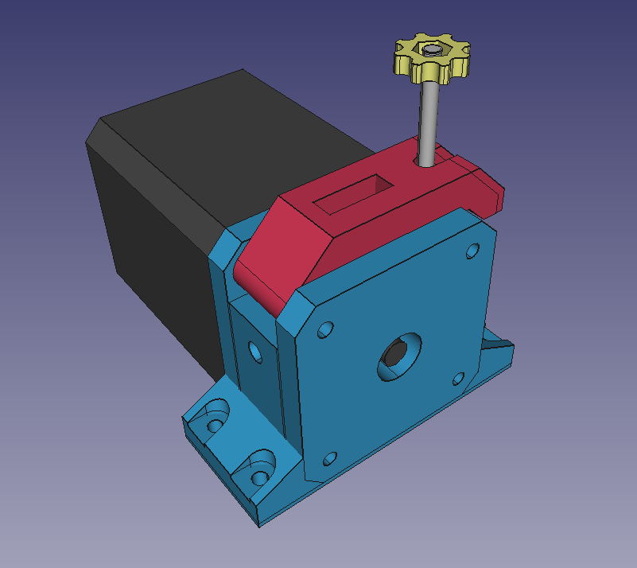

# voodoo-extruder
A compact Bowden Extruder that works with Flexible Filaments

For assembly, refer to the FreeCAD File.  
Insert a piece of Bowden-Tube into the Filamentpath until it reaches the MK8 Extrudergear,  
then screw in a M5 Pushfit into the Plastic to keep the piece of bowden to slip out again.  

Licensed under Creative Commons BY-NC-SA.  

